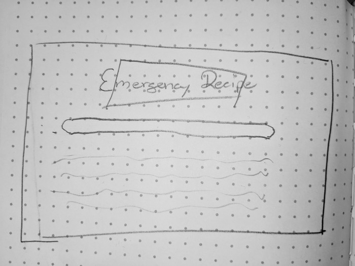
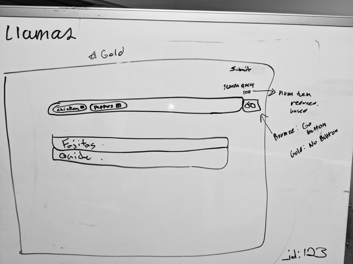
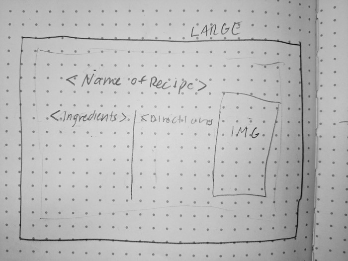
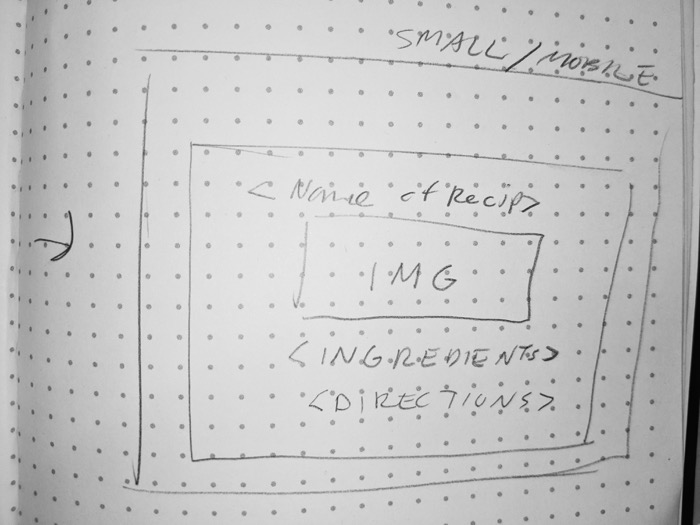

# Emergency Recipe Front End Planning

## Project Idea

When it comes to finding dinner inspiration, the way for searching for recipes online is pretty straight forward – you type in the dish you want to make, you get a recipe, you buy the ingredients, and you make the dish.

But what if you don't know what you want to make? And what if you have things laying around in the refrigerator you want to get rid off? Enter _Emergency Recipe_.

Emergency Recipe reverses the recipe search process – the user types in a list of ingredients on hand, and the service returns a list of recipes that could be made with those available items.

The front end will be built using React, with a Materialize component library. It will employ a colorful, flat design. Details on the style can be [found here](https://github.com/pnblake/emergency-recipe-front/blob/master/planning/STYLES.md).

To retrieve data it will make API calls to the back end, which is being built by another set of Coding Llamas.

More details on the backend, including a list of models and properties, can be [found here](https://github.com/pnblake/emergency-recipe-back/tree/master/planning).

## API Endpoints

API endpoints provided by the backend team can be [found here](https://github.com/pnblake/emergency-recipe-back/tree/master/planning#routes).

## Wireframes

#### Homepage

#### Homepage Idea 2

#### Recipe Page - Browser View

#### Recipe Page - Mobile View

## Miscellaneous Photos

